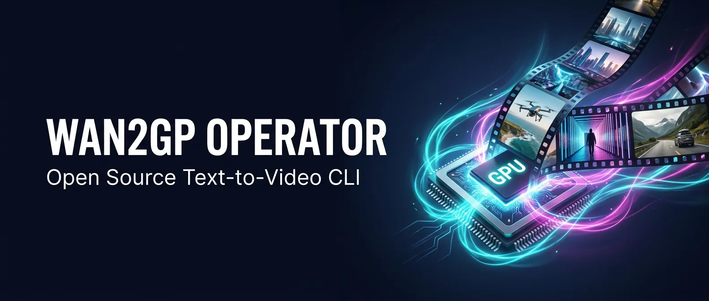

<p align="center">
  
</p>

# Wan2GP Operator - Open Source Text-to-Video CLI

[](https://github.com/avalonreset/wan2gp-operator/actions/workflows/ci.yml)
[](https://github.com/avalonreset/wan2gp-operator/releases)
[](LICENSE)

Wan2GP Operator is an open source CLI operator for WanGP/Wan2GP video generation. The goal is not to make users memorize every WanGP setting. The goal is to let Codex, Claude, or another terminal agent install WanGP, compose the right settings, run headless jobs, inspect logs, and correct course when something breaks.

Running WanGP directly means fragile prompts, wrong runtime flags, wasted generations, and no consistent troubleshooting loop. Wan2GP Operator adds the missing layer: current model guidance, VRAM-aware compose, headless batch execution, auto-retry, failure diagnosis, learned compatibility state, and a music video pipeline that turns audio tracks into beat-synced AI videos.

## Table of Contents

- [What It Does](#what-it-does)
- [Installation](#installation)
- [Quick Start](#quick-start)
- [Commands](#commands)
- [AI Music Video Pipeline](#ai-music-video-pipeline)
- [FAQ](#faq)
- [Contributing](#contributing)
- [License](#license)

## What It Does

| Capability | Description |
|------------|-------------|
| Bootstrap | Guided install, GPU detection, readiness checks |
| Compose | VRAM-aware prompt-to-settings with quality presets |
| Models | Current open-source video model guidance and curated WanGP targets |
| Run | Deterministic `--dry-run` then `--run` pipeline with structured logs |
| Evolve | Learn from failures, track compatibility state over time |
| Diagnose | Failure analysis with actionable next-step commands |
| Music Video | End-to-end audio-to-video pipeline with beat-synced generation |

This is not a GUI wrapper. It is a terminal-first agent control layer that makes Wan2GP reproducible, diagnosable, and automatable. The human gives creative intent. The agent uses the operator to choose the model target, generate settings, dry-run the job, execute it, diagnose failures, and retry with safer flags when needed.

## Installation

Clone the repository and copy it into your Codex skills directory:

```bash
git clone https://github.com/avalonreset/wan2gp-operator.git
```

### As a Codex Skill

```bash
# Linux/macOS
cp -r wan2gp-operator "$HOME/.codex/skills/wan2gp-operator"
```

```powershell
# Windows
Copy-Item -Path ".\wan2gp-operator" -Destination "$env:USERPROFILE\.codex\skills\wan2gp-operator" -Recurse -Force
```

Restart Codex after installing. The skill registers on startup.

### Prerequisites

- Python 3.11+
- A Wan2GP installation (the operator wraps it, does not replace it)
- GPU with 12GB+ VRAM recommended for quality generation
- `ffmpeg` and `ffprobe` (required for the music video pipeline)
- `librosa` (optional, improves beat detection accuracy)

## Quick Start

```bash
# 1. Check hardware readiness
python scripts/wan2gp_operator.py assess

# 2. Bootstrap Wan2GP installation
python scripts/wan2gp_operator.py bootstrap

# 3. Check current model guidance
python scripts/wan2gp_operator.py models

# 4. Compose settings from a prompt
python scripts/wan2gp_operator.py compose \
  --prompt "cinematic street shot, golden hour" \
  --quality quality \
  --duration-seconds 4

# Or target the current hot open-source audio-video model
python scripts/wan2gp_operator.py compose \
  --model ltx23-dev-22b \
  --quality quality \
  --prompt "cinematic street shot, golden hour, natural city ambience"

# 5. Dry run first, then execute
python scripts/wan2gp_operator.py run \
  --wan-root <WAN2GP_ROOT> \
  --process settings.json \
  --dry-run

python scripts/wan2gp_operator.py run \
  --wan-root <WAN2GP_ROOT> \
  --process settings.json \
  --log-file logs/run.log

# 5. Learn from the run
python scripts/wan2gp_operator.py evolve \
  --wan-root <WAN2GP_ROOT> \
  --log-file logs/run.log
```

The compose step produces a `settings.json` tuned to your GPU's VRAM. The dry run validates everything before burning compute. The evolve step records what worked and what failed into `.wan2gp_operator_state.json` so the next run is smarter.

## Commands

| Command | What It Does |
|---------|-------------|
| `assess` | Check GPU, VRAM, and system readiness |
| `bootstrap` | Full guided install of Wan2GP |
| `setup` | Configure Wan2GP environment |
| `compose` | Generate run settings from a text prompt |
| `models` | Report current hot/practical model targets |
| `plan` | Preview what a run will do before executing |
| `run` | Execute a generation (supports `--dry-run`) |
| `diagnose` | Analyze failures and suggest fixes |
| `evolve` | Record outcomes and improve future runs |
| `updates` | Check for upstream Wan2GP releases |
| `launch-ui` | Start the Wan2GP web interface |
| `music-video` | End-to-end music video generation |
| `music-analyze` | Analyze audio for BPM, beats, and sections |
| `music-plan` | Create beat-aligned shot timeline |
| `music-generate` | Generate video clips from the plan |
| `music-assemble` | Stitch clips and mux audio into final video |

## AI Music Video Pipeline

Turn one audio track into a structured, beat-synced AI music video using Wan2GP as the generation engine.

### One command

```bash
python scripts/wan2gp_operator.py music-video \
  --audio "track.mp3" \
  --theme "neon summer city, confident performance energy" \
  --model ltx23-distilled-22b \
  --wan-root <WAN2GP_ROOT> \
  --execute-generation \
  --evolve-on-failure
```

This analyzes the audio (BPM, beat grid, sections), plans shots aligned to beats, generates each clip via Wan2GP, retries failures automatically, and assembles the final video with ffmpeg.

### Stage by stage

```bash
# Analyze audio structure
python scripts/wan2gp_operator.py music-analyze --audio "track.mp3"

# Plan shots aligned to beats
python scripts/wan2gp_operator.py music-plan \
  --analysis audio_analysis.json \
  --theme "neon summer city"

# Generate each clip
python scripts/wan2gp_operator.py music-generate \
  --plan music_video_plan.json \
  --wan-root <WAN2GP_ROOT> \
  --model ltx23-distilled-22b \
  --execute-generation

# Assemble final video
python scripts/wan2gp_operator.py music-assemble \
  --audio "track.mp3" \
  --manifest generation_manifest.json
```

### Output artifacts

| File | Contents |
|------|----------|
| `audio_analysis.json` | Duration, BPM, beat grid, sections |
| `music_video_plan.json` | Beat-aligned shot timeline and prompts |
| `generation_manifest.json` | Per-take compose/run/evolve results |
| `music_video_master.mp4` | Final video with audio muxed in |

## FAQ

### What is the best open source video model?

As of 2026-05-10, the operator treats **LTX-2.3 22B** as the hottest general open-source audio-video target because it combines video and native synchronized audio in one model. **Wan 2.2 14B** remains the strongest Wan-family workhorse inside WanGP, especially for text-to-video and image-to-video without learning a node graph.

Run:

```bash
python scripts/wan2gp_operator.py models
```

For high-memory machines, skip tiny demo models unless debugging install health:

```bash
python scripts/wan2gp_operator.py compose --model ltx23-dev-22b --quality quality --prompt "<PROMPT>"
```

For faster iteration:

```bash
python scripts/wan2gp_operator.py compose --model ltx23-distilled-22b --quality balanced --prompt "<PROMPT>"
```

Wan2GP Operator wraps WanGP/Wan2GP and adds operational tooling: model selection, VRAM-aware settings, batch execution, failure diagnosis, and evolution tracking.

### Can this generate AI music videos?

Yes. The music video pipeline analyzes your audio track (BPM, beats, sections), generates beat-synced video clips through Wan2GP, retries failed generations automatically, and assembles the final video with ffmpeg. One command or four stages, depending on how much control you want.

### Does this work with Codex and Claude?

Yes. The repo includes `SKILL.md` for skill-suite installs, `AGENTS.md` for Codex-style agent instructions, and `CLAUDE.md` for Claude Code/project context. Install with:

```bash
python scripts/install_skill.py --platform codex --scope user
python scripts/install_skill.py --platform claude --scope user
```

### How is this different from ComfyUI?

ComfyUI is a node-based GUI for chaining AI models visually. Wan2GP Operator is a terminal-first CLI that wraps Wan2GP specifically. The tradeoffs: ComfyUI gives you visual flexibility across many models. Wan2GP Operator gives you reproducible, scriptable, headless batch execution with built-in failure diagnosis for Wan2GP specifically.

## Contributing

Contributions are welcome. See [CONTRIBUTING.md](CONTRIBUTING.md) for development setup, code style, and PR workflow.

For bugs and feature requests, [open an issue](https://github.com/avalonreset/wan2gp-operator/issues). For questions and ideas, use [Discussions](https://github.com/avalonreset/wan2gp-operator/discussions).

For security vulnerabilities, do not open a public issue. See [SECURITY.md](SECURITY.md).

Join [AI Marketing Hub Pro](https://www.skool.com/ai-marketing-hub-pro/about?ref=59f96e9d9f2b4047b53627692d8c8f0c) for access to exclusive projects (referral link).

## Other Projects

**[gemini-seo](https://github.com/avalonreset/gemini-seo)** - 14 professional SEO workflows for Gemini CLI. Technical audits, schema markup, Core Web Vitals, E-E-A-T, and AI search readiness.

**[codex-seo](https://github.com/avalonreset/codex-seo)** - Same firepower, built for Codex CLI. 12 workflows, 6 parallel agents, client-ready HTML/PDF reports from your terminal.

**[BenjaminTerm](https://github.com/avalonreset/BenjaminTerm)** - Hacker-styled WezTerm distribution for Windows. Smart clipboard, paste undo, 86 curated dark themes, borderless glass mode.

## License

MIT License. See [LICENSE](LICENSE).
