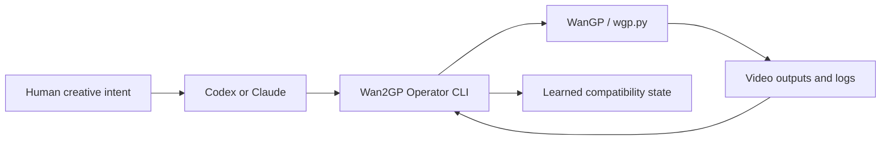

# Wan2GP Operator Overview

Wan2GP Operator is a terminal-first control layer for WanGP. Its purpose is to
let Codex, Claude, or another agent handle the operating details of local video
generation: install readiness, WanGP setup, model guidance, settings
composition, dry-runs, headless execution, log capture, failure diagnosis, and
learned compatibility state.

> [!key-insight]
> The operator is not a replacement for WanGP. It is the agent control surface
> that makes WanGP reproducible, diagnosable, and easier to run without learning
> every UI setting.

## Current Release Posture

The latest release in this vault snapshot is `v0.5.3`. The recent release arc:

- `v0.5.0`: current model guidance and curated model targets.
- `v0.5.1`: model targets passed through the music-video pipeline.
- `v0.5.2`: high-memory quality recommendations for 96GB+ systems.
- `v0.5.3`: public docs clarified the agent-operated workflow.

## Core System Shape

## Priority Domains

- [[Development Operations]]
- [[Model Research]]
- [[Release Track]]
- [[User Handoff]]
